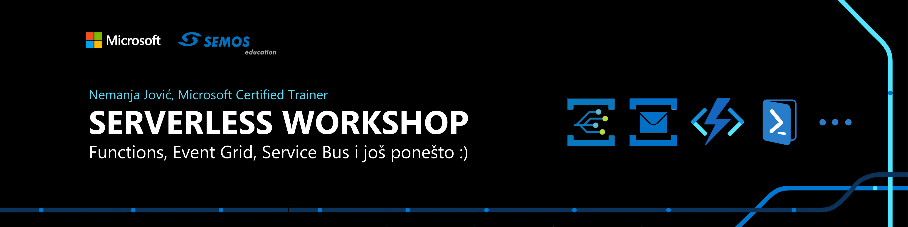
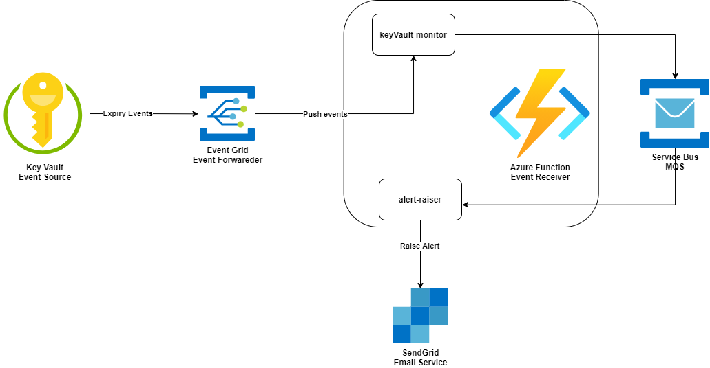

# Serverless Workshop - Azure Functions, Event Grid, Service Bus &amp; More  

  

## Disclaimer  

*Primary language of the repository content is English, due to ease of distribution and understanding purposes.*  
*Content of this repository is used for Educational purposes ONLY, and it does not contain any confidential or pirated information.*  

## Preface  

Hi there! Thank's for attending the workshop event, or just going through this repository - you're at a good place!  
The event is organised in collaboration between [Semos Education](https://semosedu.com.mk/Home_page.aspx) & [Nemanja Jovic (Neo)](https://www.linkedin.com/in/neopsyon).  
Workshop is intended for people who're interested and want to learn more about Azure Cloud, or more specifically about serverless stack within the Azure.  
Services that will be covered are among [Azure Function](https://docs.microsoft.com/en-us/azure/azure-functions/#:~:text=Azure%20Functions%20is%20a%20cloud,provides%20serverless%20compute%20for%20Azure.), [Service Bus](https://docs.microsoft.com/en-us/azure/service-bus-messaging/service-bus-messaging-overview),  [Event Grid](https://azure.microsoft.com/en-us/services/event-grid/#resources) & [PowerShell](https://docs.microsoft.com/en-us/powershell/scripting/overview?view=powershell-7.1).

## Goal  

People who attend this workshop can expect as a takeway

1. *Common understanding of multiple Azure Services.*
2. *Discussion about architectural design patterns.*
3. *Mindset behind building serverless technology solutions.*
4. *Understanding of CI/CD used to Build(PowerShell) and Deploy(Azure Services + Code).*
5. *Live coding session, Azure Function code will be developed during the session.*
6. *Live troubleshooting session, since the session format will be freestyle trial and error.*

## Repository content  

Content of this repository is based on existing OpenSource [Azure Key Vault Monitoring Framework](https://github.com/schubergphilis/keyVault-monitoring-framework), project is used as a shortcut for workshop purposes and inspirational idea, framework is built by the author of the workshop.  
*Content includes*  

1. Azure Pipelines pipeline, used to Build, Test, Deploy infrastructure and Application/PowerShell code.
2. ARM templates for infrastructure automation.
3. Parameters for the infrastructure environment.
4. Application/PowerShell code dedicated to Azure Function - which is a primary application that serves a purpose.
5. PowerShell helper module - containing code for sending email using SendGrid service.
6. Side scripts used inside the pipeline.  

## Components and architecture  

Based on architectural diagram we can conclude  

1. Azure Key Vault service is used as the event source, Microsoft has great documentation about every service that supports event delivery through event grid - [LINK](https://docs.microsoft.com/en-us/azure/event-grid/event-schema-key-vault?tabs=event-grid-event-schema).
2. Azure Function service is used as the endpoint that will receive event data generated by Azure Key Vault service, utilizing Azure Function, we are able to deploy a custom code that will intelligently handle event data.
3. Azure Function will have two endpoints, keyVault-monitor and alert-raiser, both functions will be developed during the workshop.
4. Event Grid is utilized as a man-in-the-middle service, and it will deliver events generated by the source(Key Vault) to the endpoint/destination(Azure Function).
5. Service Bus is used as message queing system in order to facilitate event-driven communication among microservices, in our case these microservices are different Azure Function internal functions.

## Steps & Manual

1. You will need an Azure Account + Subscription, and Azure DevOps account and a project.  
2. If you do not have a subscription, create it.  
3. Head to Azure AD, under application you will provision a new application.  
   1. This entity will serve as deployment entity.
   2. It will have Contributor rights over the subscription created in previous step.
   3. Give Aplication a sensible name, such as *serverlessworkshop-prd001-spn*, where spn stands for service principal.
   4. Under credentials, generate new credentials for this application, they could be secret based, this credentials will be used as a service connection for deployment purposes from Azure DevOps towards Azure(ARM).
   5. In the [Azure Portal](https://portal.azure.com), head to Subscriptions, under IAM blade assign the Contributor rights to previously created Application / SPN.
   6. Head to [Azure DevOps Portal](https://dev.azure.com), create a project, under project settings, navigate to service connections, create new connection based on Azure Resource Manager, provide all needed information.
4. In the Azure DevOps, head to Repositories, click on Import Repository and provide [URL to Serverless Workshop repository](https://github.com/neopsyon/semos-azure-serverlessworkshop.git).
5. In the Azure DevOps, head to Pipelines and create a new pipeline, choose to create a pipeline from the existing repository, and pick the azure-pipelines.yaml file from _ci repository.
6. Woala, you have a working pipeline that will deploy infrastructure and code for you, please make sure to provide correct parameters when running the pipeline - parameter values have to mirror your environment
   1. Service connection name that you previously created.
   2. Name of the resource group that you want to target, does not need to exist beforehand.
